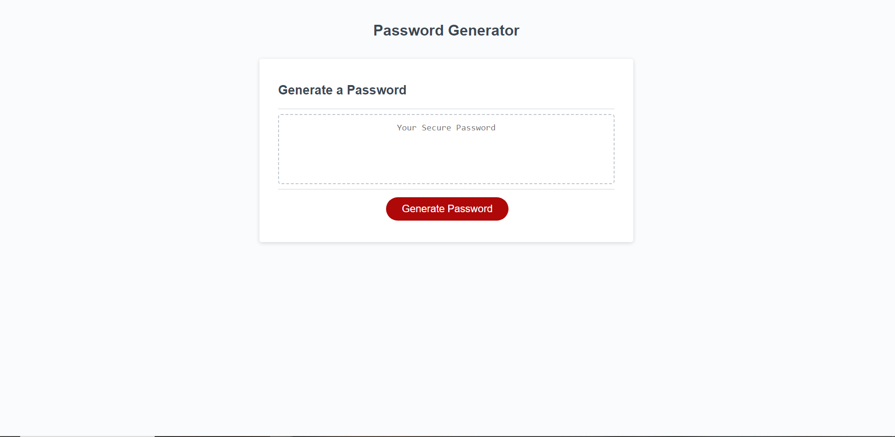

# Password Generator
## Screenshot of the Deployed Page

## URLs
* [Github Repository](https://github.com/SoloSolaire/password-generator)
* [Deployed Page](https://solosolaire.github.io/password-generator/)

## Description
For week 3's challenge, I have added code to create a functional password generator. This generator creates strong passwords as there is high variance for each character. It allows for your password to have lowercase and/or uppercase letters, numbers and special characters. This generator can create a password in between 8 to 128 characters long.